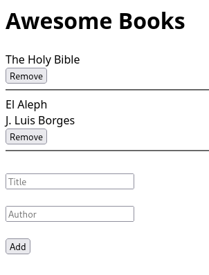

# Project Name

> Basic website that allows users to add/remove books from a list.



Using JavaScript objects and arrays.

## Built With

- JavaScript
- Plain HTML 
- Basic UI

## Live Demo

[Live Demo Link](https://livedemo.com)


## Getting Started

- Clone the repository using:
```shell
   git clone git@github.com:Cathella/Awesome-Books.git
``` 
- cd Awesome-Books

- Install Visual Studio extension [Live Server](https://marketplace.visualstudio.com/items?itemName=ritwickdey.LiveServer)

- Enable Live Server

- Add and remove Books!

## Authors

👤 **Nakitto Catherine**

- GitHub: [@Cathella](https://github.com/Cathella)
- Twitter: [@cathella9](https://twitter.com/cathella9)
- LinkedIn: [Nakitto Catherine](https://www.linkedin.com/in/nakitto-catherine2020/)

👤 **Manuel Aldaraca**

- GitHub: [@vicmaburrito](https://github.com/vicmaburrito)
- Twitter: [@ManuelAldaraca](https://twitter.com/twitterhandle)
- LinkedIn: [ Manuel Aldaraca ](https://www.linkedin.com/in/manuelaldaraca/)

## 🤝 Contributing

Contributions, issues, and feature requests are welcome!

Feel free to check the [issues page](../../issues/).

## Show your support

Give a ⭐️ if you like this project!


## 📝 License

This project is [MIT](./MIT.md) licensed.
